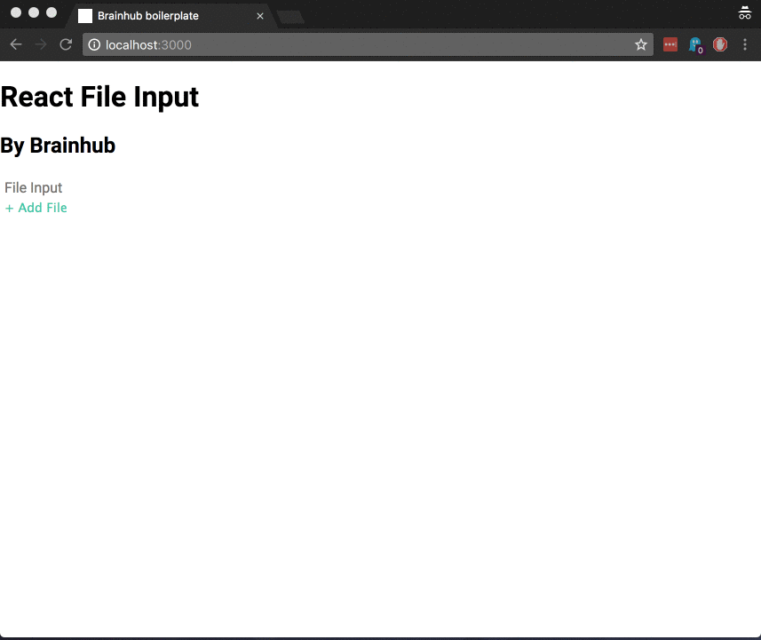

# react-file-input
[](https://circleci.com/gh/brainhubeu/react-file-input)
A File Input, width drag'n'drop and image editor.

## Why?
> And image is worth thousand words



## Installation
```sh
npm i @brainhubeu/react-file-input
```
Or if you prefer
```sh
yarn add @brainhubeu/react-file-input
```
## Usage
### Styles
The Component comes with custom `css`. You must import them using our component (if not things will look wrong). Of course you could also override them ;)

```javascript
// index.js
import React from 'react';
import { render } from 'react-dom';

import App from './App';

import '@brainhubeu/react-file-input/dist/react-file-input.css';

render(
  <App />,
  document.getElementById('app')
);
```

Or if you prefer from your stylesheet directly:
```sass
@import "~@brainhubeu/react-file-input/dist/react-file-input.css";

// very good css here...
```
## Usage
The basic usage is very simple, the only important prop you have to pass is `onChangeCallback`:

```javascript
import React from 'react';
import FileInput from '@brainhubeu/react-file-input';
import doSomethingWithMyFile from '../utils/doThings';

const MyFileUploader = () => (
  <div>
    <FileInput
      label='Awesome Uploader'
      onChangeCallback={doSomethingWithMyFile}
    />
  </div>
);

export const MyFileUploader;
```
And your set and read to `do something with your file`.

See the reference below for more advanced usages.

### Usage with Redux Form
Probably you are not crazy enough to handle your forms like in 1999. Chances are that you are using `redux-form`. If so, it's your lucky day, because you can use our `FileInput` with `redux-forms`. Here's a basic example:
```javascript
// MyFileUploader.js
import React from 'react';
import FileInput from '@brainhubeu/react-file-input';

const MyFileUploader = ({ input, label }) => (
  <FileInput
    label='Awesome Uploader'
    onChangeCallback={input.onChange}
    onDragEnterCallback={input.onFocus}
    onDragLeaveCallback={input.onBlur}
  />
);
```
```javascript
// MyGreatForm.js
import MyFileUploader from './MyFileUploader'

...

<Field name="myField" component={MyFieldUploader}/>
```
And that's it. Prepare some coffee and enjoy.
## Reference
### FileInput
propName | type | required | default | description
---------|------|----------|---------|------------
className|`string`|no|''|Custom className
dropAreaClassName|`string`|no|''|Custom className for the DropArea
fileInfoClassName|`string`|no|''|Custom className for the FileInfo
imageEditorClassName|`string`|no|''|Custom className for the ImageEditor
dragOnDocument|`boolean`|no|true|Listen for drag events in the whole document
dropOnDocument|`boolean`|no|false|Allow to drop on document
label|`string`|yes||Label for the input
metadataComponent|`React Component`|no|null|Custom component for the metadata. Props: `name`, `size`, `extension`, `type`
thumbnailComponent|`React Component`|no|null|Custom component for the image thumbnail. Props: `children` (`` node with the thumbnail)
displayImageThumbnail|boolean|no|true|Whether to generate a thumbnail for image files
cropAspectRatio|`number`|no|0|If cropTool is enabled, the aspect ratio for the selection. 0 means the selection is free
cropTool|boolean|no|false|Wheter to render a crop tool for image files
scaleOptions| ``` {width: number, height: number: keepAspectRatio: boolean}```| no|null|Scale option for file images. `keepAspectRatio` refers to if the original aspect ratio should be kept when appliyin scaling
onChangeCallback|`function`|no|null|Callback invoked when a file is selected. It is called with the current state of the component
onDragEnterCallback|`function`|no|null|Callback invoked when drag enters. It is called with the current state of the component
onDragLeaveCallback|`function`|no|null|Callback invoked when drag leaves. It is called with the current state of the component

## Example
To run the example just:
```sh
npm run dev:example
// or
yarn dev:example
```

And go to `http://localhost:3000`

## License

react-carousel is copyright © 2014-2018 [Brainhub](https://brainhub.eu/) It is free software, and may be redistributed under the terms specified in the [license](LICENSE.md).

## About

react-carousel is maintained by the Brainhub development team. It is funded by Brainhub and the names and logos for Brainhub are trademarks of Brainhub Sp. z o.o.. You can check other open-source projects supported/developed by our teammates here. 

[](https://brainhub.eu/?utm_source=github)

We love open-source JavaScript software! See our other projects or hire us to build your next web, desktop and mobile application with JavaScript.
